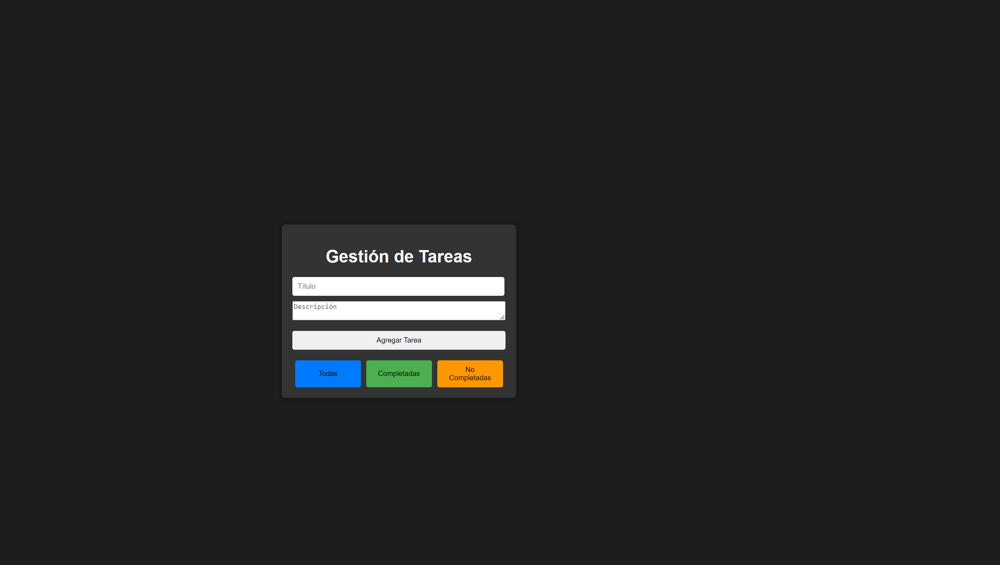
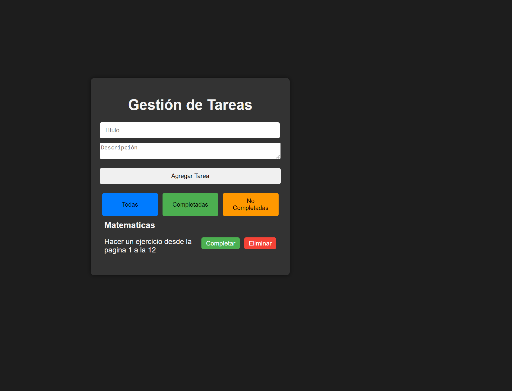
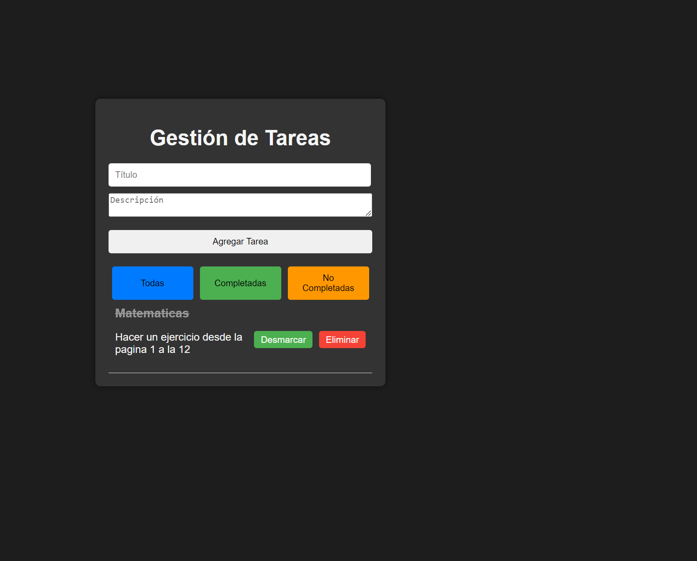

# Aplicación de Gestión de Tareas

## Descripción del Proyecto

Este proyecto es una aplicación web de gestión de tareas desarrollada utilizando React. Permite a los usuarios crear, gestionar y organizar sus tareas diarias. Los usuarios pueden agregar nuevas tareas con un título y una descripción, marcar tareas como completadas, eliminar tareas y filtrar la vista para mostrar tareas completadas, no completadas o todas.

La aplicación está diseñada para practicar conceptos clave de React, incluyendo el manejo de componentes, estado, props, eventos y renderizado condicional. También incluye funcionalidades avanzadas como la gestión de estados complejos y depuración de aplicaciones React.

## Tecnologías Utilizadas

- **React**: Biblioteca de JavaScript para construir interfaces de usuario.
- **Vite**: Herramienta de construcción rápida para el entorno de desarrollo.
- **Herramientas de Desarrollo de Google Chrome**: Para depuración y análisis de la aplicación.

## Funcionalidades

- **Agregar Tareas**: Permite a los usuarios crear nuevas tareas con un título y una descripción.
- **Marcar Tareas como Completadas**: Los usuarios pueden cambiar el estado de una tarea a completada.
- **Eliminar Tareas**: Las tareas pueden ser eliminadas de la lista.
- **Filtrar Tareas**: Los usuarios pueden filtrar la lista de tareas para mostrar solo completadas, no completadas o todas.
- **Estado Complejo**: La aplicación maneja el estado de la lista de tareas de manera eficiente y reactiva.
- **Renderizado Condicional**: Muestra diferentes vistas basadas en el estado de las tareas.

## Objetivos del Proyecto

1. Crear una aplicación web completa utilizando React.
2. Aplicar los conceptos de componentes, estado, props y eventos.
3. Manejar estados complejos y renderizado condicional.
4. Implementar una funcionalidad de gestión de tareas.
5. Practicar la depuración de aplicaciones React.
6. Presentar la aplicación en funcionamiento y subir el código a GitHub.

## Instalación y Uso

1. **Clonar el Repositorio:**
   
    **git clone https://github.com/PerezErikson/Tarea.git**
   
 **Clona el repositorio de GitHub en tu máquina local. Esto descarga una copia del código fuente del proyecto en tu directorio actual.**
   
3. **Navegar al Directorio del Proyecto:**
   
   **cd Tarea**
   
 **Cambia el directorio actual al directorio del proyecto descargado. Esto es necesario para ejecutar los comandos de instalación y desarrollo dentro del contexto del proyecto.**
 
5. **Instalar Dependencias:**

 **npm install**
 
 **Instala todas las dependencias necesarias para el proyecto que están listadas en el archivo package.json. Esto incluye React, Vite y cualquier otra biblioteca o herramienta que el proyecto necesite para funcionar correctamente.**
 
4. **Iniciar el Servidor de Desarrollo:**
   
    **npm run dev**
   
**Inicia el servidor de desarrollo. Esto compila el proyecto y lo sirve en un entorno de desarrollo local, generalmente accesible en http://localhost:3000. El servidor también observa los cambios en el código fuente y actualiza la aplicación en el navegador en tiempo real.**

## Video de Demostración

<video width="640" height="480" controls>
  <source src="/img/video/12.mp4" type="video/mp4">
  Tu navegador no soporta la etiqueta de video.
</video>
